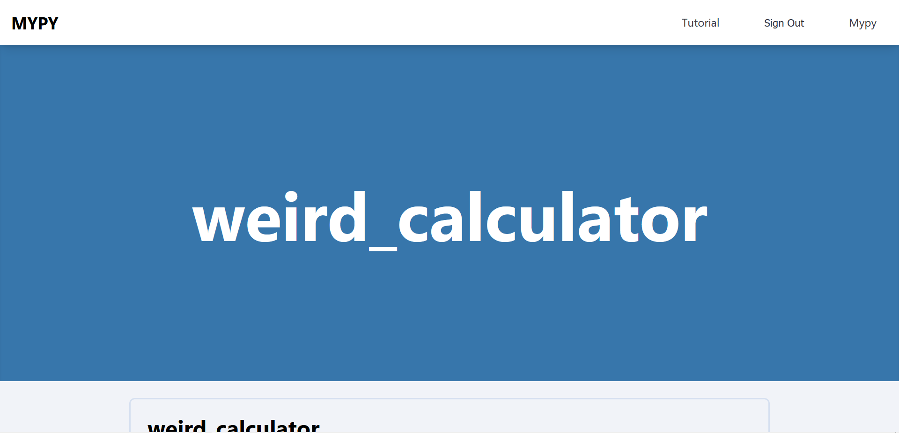
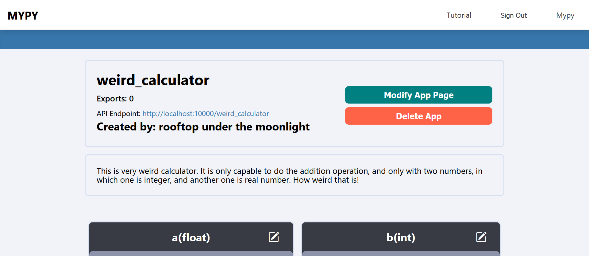
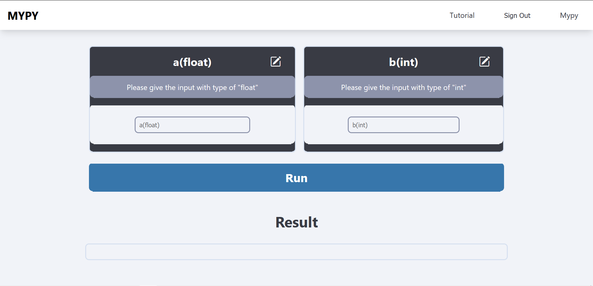

# MYPY

# 개요

> [!NOTE]\
> 아래의 설명은 작성자가 MYPY라고 하는 앱을 UNIST 컴퓨터 공학 동아리 HeXA에 배포하기 위한 Proposal입니다.
> [Introduction.md](./Introduction.md)의 내용과 같습니다.

> [!NOTE]\
> 본 앱의 더 자세한 설명은 [튜토리얼 페이지](./frontend/pages/tutorial/index.js) 코드에 남겨져 있습니다.

## 요약

제가 배포하려고 하는 앱의 이름은 MYPY라고 하는 앱입니다.
이 앱의 주요기능은 파이썬으로 작성된 앱을 디플로이 해주고,
파이썬 스크립트로만 작성된 앱에 UI를 만들어 마치 진짜 앱을 쓰는듯한
경험을 제공합니다. 헥사 서버에 디플로이 하게 된다면 프로토타이핑을 비롯해
서버의 상태를 모니터링하는 등 만약 추후에 제가 이 앱의 규모를 키워간다면 참고가 될 수 있는
여러 실험을 진행해볼 예정입니다.

## 앱의 이름에 대해서

제가 현재 생각하고 있는 이름은 MYPY supported by HeXA이나, 더 직접적으로 동아리 이름을 넣어야 한다면
MYPY_HeXA나 HeXA_MYPY로 하는 것도 좋습니다.

## 예시

파이썬으로 만든 계산기 앱을 디플로이 하는 과정을 예로 설명드리겠습니다.
앱의 폴더구조와 각각의 스크립트는 다음과 같습니다

weird_calculator

---

|- index.py

---

|- add_two_numbers.py

```python
# index.py
from add import add_two_numbers

a=float()
b=int()

def main():

    result = add_two_numbers(a,b)

    return result

```

```python
# add_two_numbers.py

def add_two_numbers(a,b):
    return a+b
```

MYPY는 앱의 루트폴더에 있는 index.py에 main 함수의 리턴값을 MYPY에 디플로이된 앱의 output으로 돌려줍니다.
그리고 main 함수 위에 정의되어있는 `a=float()` , `b=int()` 를 MYPY는 클라이언트로부터 받을 Input으로 인식합니다.

이 앱을 .zip으로 압축해서 MYPY에 올리면, 다음과 같은 앱 화면 페이지가 표시됩니다.





위의 앱 페이지에서, 인풋에 값들을 넣고 RUN을 누르면 위의 스크립트들이 실행되고 main() 함수의 리턴값이 result에 반환됩니다.

계산기는 매우 간단한 예시였고, MYPY의 활용은 파이썬으로 만들수 있는 웹크롤러나 복잡한 Input processor 등으로 확장 가능합니다.

P.S. 혹시 궁금한 사항이 있으시다면 물어봐주셔도 좋습니다!

# 구현

아래 섹션에서는 본 애플리케이션의 구현이 어떻게 이루어졌는지를 설명합니다.

## Tech Stack

### Backend

- Django/DRF
- Flask

### Frontend

- Next.js
- Redux
- Sass

## How it works

### 애플리케이션의 생성

파이썬 코드에 기반한 애플리케이션의 생성과정은 다음과 같습니다.

1. [frontend/pages/create.js](./frontend/pages/create.js) 페이지에서 앱 이름, 앱 소스코드를 포함한 .zip 압축 파일을 form에 입력합니다.
2. Submit 시 [frontend/redux/slices/create-app.js](./frontend/redux/slices/create-app.js)의 `createApp` 함수를 실행하게 됩니다. 이는 [backend/apps/apps/views.py](./backend/apps/apps/views.py)의 `CreateAppView.post`를 호출합니다.
3. `CreateAppView.post`는 아래의 과정을 통해 애플리케이션을 생성하고, 생성된 애플리케이션의 ID를 반환합니다.
   1. 클라이언트에서 전송한 정보를 바탕으로 DB (SQL)에 애플리케이션 정보를 저장하고 앱에 ID와 포트 값을 할당합니다.
   2. [backend/config/settings.py](./backend/config/settings.py)에 있는 `MEDIA_ROOT`에 앱 ID를 이름으로 하는 폴더를 생성합니다.
   3. POST 로 전송된 앱의 .zip 파일을 압축 해제하여 저장합니다.
   4. 유저가 업로드한 코드에서 유저가 정의한 입력을 프로그램적으로 주입할 수 있도록 소스 코드를 수정합니다.
      1. 유저의 코드는 항상 `index.py` 에서 시작합니다.
      2. 유저의 input은 파이썬 빌트인 `input` 함수와 빌트인 type wrapper를 통해 정의됩니다. (e.g. `a = int(input())`)
      3. `CreateAppView.post`는 위와 같은 코드를 찾아 변수 이름, 타입을 파싱하고 변수의 정보를 DB에 저장합니다.
      4. `CreateAppView.post`는 유저의 코드에서 `main` 함수를 찾아 `main` 함수의 인자로 2-3번 항목에서 수집한 변수를 `__variables` 인자로 주입합니다.
      5. 또한 유저는 .zip 아카이브에 파일을 업로드할 수 있습니다. 이는 런타임에서 본 애플리케이션이 `__file_root` 변수를 주입하고, .zip 파일의 상대 경로 기준으로 위 변수와 `os.path.join`을 통해 파일을 참조할 수 있습니다.
   5. 4번에서 수정된 소스코드를 실행하는 Flask 앱을 만듭니다. 
      1. [backend/static/flask_server/server/app](./backend/static/flask_server/server/app) 내의 파일을 boilerplate로 사용합니다. 
      2. Flask 앱은 보일러플레이트 코드에는 유저가 업로드한 파이썬 함수를 호출하는 엔드포인트를 포함합니다. 이는 $NAME 엔드포인트로 추가되고, 리턴 값을 Flask Response로 알맞게 반환하기 위한 __MIMETYPE 상수가 선언되어 있습니다. 
      3. 여기서 $NAME과 $MIMETYPE은 유저가 입력한 앱 이름과 리턴 타입으로 수정됩니다.
   6. 위 플라스크 앱을 배포하기 위한 Dockerfile과 docker-compose.yml을 생성합니다.
      1. [backend/static/flask_server/server/Dockerfile](./backend/static/flask_server/server/Dockerfile)과 [backend/static/flask_server/server/docker-compose.yml](./backend/static/flask_server/server/docker-compose.yml)을 참조합니다.
         1. 만약 함수의 반환값이 Pillow Image 객체라면, Dockerfile의 __PILLOW 리터럴을 pillow 패키지 이름으로 대체합니다.
         2. 만약 업로드 폴더에 requirements.txt가 존재하면, __INSTALL_DEPENDENCIES 리터럴을 `RUN pip install -r requirements.txt`로 대체합니다.
         3. docker-compose.yml의 $PORT 리터럴을 앱의 포트로 대체합니다.
   7. 위에서 생성된 모든 아카이브를 압축하여 [server/routes/create.py](./server/routes/create.py) 의 '/create' 엔드포인트로 전송해 앱을 배포합니다.
      1. 이 엔드포인트는 압축된 아카이브를 받아 docker-compose 커맨드를 통해 유저가 업로드한 앱을 컨테이너로 실행합니다.
4. 반환이 성공적으로 이루어지면 생성한 앱의 페이지로 리다이렉트합니다.

### 애플리케이션의 실행

[위의 과정](###애플리케이션의-생성)을 통해 생성된 애플리케이션은 다음과 같은 과정을 통해 실행됩니다.

1. [frontend/pages/app/\[id\]/index.js](frontend/pages/app/[id]/index.js)에 [위의 과정](###애플리케이션의-생성)을 통해 생성된 IPO(Input-Process-Output) 앱이 렌더링됩니다. ([예시](##예시) 참조)
2. 유저는 앱의 input 목록에 원하는 값을 입력하고 실행 버튼을 누릅니다.
3. 실행 버튼을 누르면 [frontend/redux/slices/execute-app.js](./frontend/redux/slices/execute-app.js)의 `executeApp` 함수가 호출됩니다. 이는 [backend/static/flask_server/server/app/__app.py](./backend/static/flask_server/server/app/__app.py) 의 $NAME 엔드포인트로 POST 요청을 보냅니다.
4. [backend/static/flask_server/server/app/__app.py](./backend/static/flask_server/server/app/__app.py) 의 $NAME 엔드포인트는 유저가 업로드한 파이썬 함수를 request로 받은 input과 함께 호출하고, 리턴 값을 Flask Response로 알맞게 반환합니다.
5. 반환이 성공적으로 이루어지면 [frontend/pages/app/\[id\]/index.js](frontend/pages/app/[id]/index.js)의 `executeApp` 함수는 리턴 값을 받아 [frontend/redux/slices/execute-app.js](./frontend/redux/slices/execute-app.js)의 `executeAppSuccessful` 리듀서를 호출하여 반환값의 상태를 업데이트 합니다. 이는 앱 UI에 반영되어 유저에게 보여집니다.
